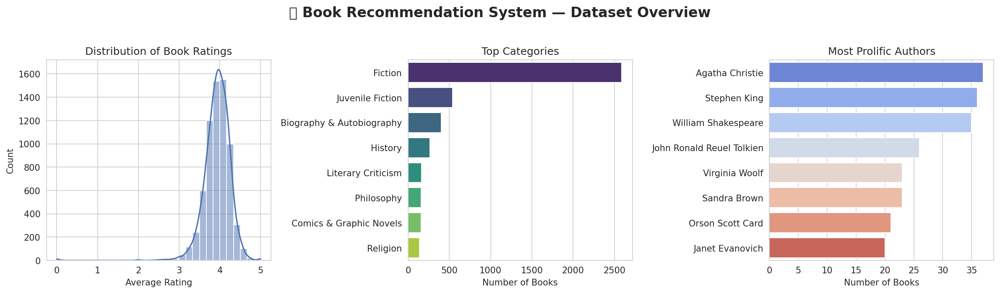

# 📚 Book Recommendation System



A machine learning project that analyzes a dataset of **6,810 books** to uncover rating patterns and recommend books — combining exploratory data analysis, a rating-class prediction model, and a popularity-based Top 100 recommendation list.

---

## 📖 Overview

This project explores a books dataset (title, authors, categories, ratings, description, page count) to:

1. Understand what drives book ratings through **EDA and correlation analysis**.
2. Predict a book's **rating class** (`low` / `medium` / `high`) using a **Random Forest Classifier**.
3. Generate a **Top 100 recommended books** list based on average rating and number of ratings.

---

## 📊 Dataset

- **Source:** `books.csv`
- **Size:** 6,810 records, 12 original columns
- **Key columns:** `title`, `authors`, `categories`, `description`, `published_year`, `average_rating`, `num_pages`, `ratings_count`
- **Unique categories:** 567
- **Unique authors:** 3,780

---

## 📁 Project Structure

```
book-recommendation-system/
├── final.ipynb       # Main notebook (EDA, feature engineering, modeling, recommendations)
├── books.csv          # Dataset
├── banner.png          # README overview image
└── README.md
```

---

## ⚙️ Methodology

### 1. Data Cleaning & EDA
- Checked data types, missing values, and duplicates.
- Visualized the distribution of average ratings, top categories, top authors, and publication years.
- Engineered features: `book_age` (2025 − published year), `missing_description` flag, `desc_length`, `title_word_count`.
- Explored correlations between `book_age`, `num_pages`, `missing_description`, and `average_rating`.

### 2. Rating Classification Model
- Binned `average_rating` into 3 classes: **low** (≤3.5), **medium** (3.5–4.2), **high** (>4.2).
- Grouped rare categories/authors into an `Other` bucket (top 15 categories, top 30 authors kept individually).
- Built a `ColumnTransformer` pipeline: `StandardScaler` for numeric features, `OneHotEncoder` for categorical features.
- Trained a **Random Forest Classifier** (`n_estimators=100`, `class_weight='balanced'`) on an 80/20 stratified train-test split.

### 3. Popularity-Based Recommendations
- Ranked unique books by `average_rating` then `ratings_count` to produce a **Top 100 books** list.

---

## 📈 Results

The dataset is imbalanced toward medium-rated books (5,092 medium vs. 1,101 high vs. 465 low), which is reflected in the model's performance:

| Metric        | Score  |
| :------------ | :----- |
| **Accuracy**  | 66.7%  |
| **Precision** | 64.0%  |
| **Recall**    | 66.7%  |
| **F1-Score**  | 65.2%  |

The model predicts the majority **medium** class well (F1 ≈ 0.80) but struggles on the minority **low** and **high** classes — expected given the class imbalance and that page count/book age/category are fairly weak predictors of a subjective rating.

---

## 🚀 How to Run

### Requirements
```bash
pip install pandas numpy matplotlib seaborn scikit-learn
```

### Steps
1. Make sure `books.csv` is in the project root.
2. Run the notebook:
   ```bash
   jupyter notebook final.ipynb
   ```
3. Run all cells to reproduce the EDA plots, train the classifier, and generate the Top 100 recommended books list.

---

## 🔮 Future Work

- Add content-based recommendations using book descriptions (TF-IDF / embeddings).
- Address class imbalance with SMOTE or alternative resampling.
- Incorporate collaborative filtering if user-level rating data becomes available.
